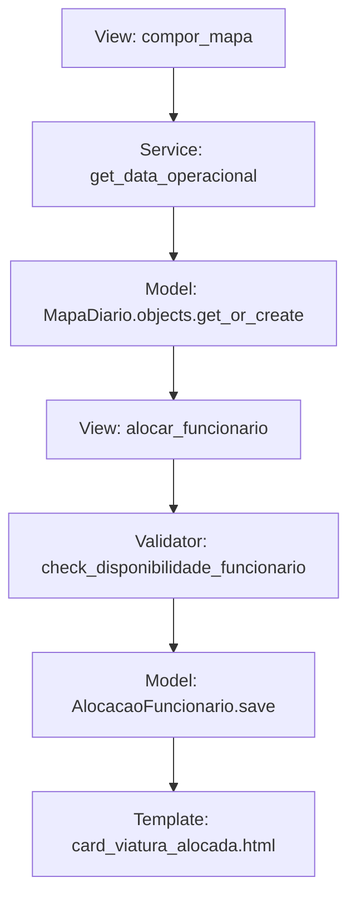

# 🔗 APIs e Integrações

O sistema utiliza endpoints internos para orquestrar as interações HTMX e integrações externas para sincronização de dados institucionais.

## 🛠️ Endpoints HTMX (Backend de Interação)

Estes endpoints não retornam JSON, mas fragmentos de HTML (**Partials**) que o HTMX injeta no DOM.

### Gestão da Escala (`/escalas/`)
- **`POST /alocar/`**: Recebe `funcionario_id`, `viatura_id` e `funcao_id`. Retorna o card da viatura atualizado.
- **`DELETE /remover-alocacao/`**: Remove um militar da guarnição e retorna o card da viatura.
- **`GET /busca-funcionarios/`**: Filtra funcionários dinamicamente conforme o usuário digita.

### Hierarquia (`/unidades/`)
- **`GET /unidades/subgrupamentos/`**: Carrega subgrupamentos filtrados por batalhão.
- **`GET /unidades/postos/`**: Carrega postos filtrados por subgrupamento.

---

## ☁️ Integração Google OAuth 2.0

O sistema utiliza a autenticação do Google para garantir que apenas usuários institucionais acessem a plataforma.

### Configuração Requerida (`.env`)
- `GOOGLE_CLIENT_ID`: ID do projeto no Google Cloud Console.
- `GOOGLE_CLIENT_SECRET`: Segredo da API do Google.

### Fluxo de Segurança
1. O usuário se autentica via Google.
2. O `ApprovalSocialAccountAdapter` do Django intercepta a criação.
3. Se for o primeiro acesso, o usuário é criado com `is_active=False`.
4. Um administrador deve ativar o usuário e atribuir o nível de acesso (`BATALHAO`, `SGB`, `POSTO`).

---

## 📊 Sincronização via Management Commands

Para manter o banco de dados local alinhado com o sistema central da corporação (SGO/SIGO), o sistema lê planilhas Google Sheets publicadas em formato XLSX/CSV.

### Comandos Disponíveis
```bash
# Sincroniza o efetivo completo
python manage.py sync_efetivo_sheets

# Sincroniza a frota de viaturas
python manage.py sync_viaturas_sheets

# Importa os postos de serviço
python manage.py importar_postos
```

### Motor de Processamento (Pandas)
A lógica de importação utiliza o **Pandas** para:
1. Ler a URL da planilha Google (versão exportação).
2. Limpar dados duplicados ou formatos inválidos.
3. Comparar registros atuais com novos para decidir entre `update` ou `create`.
4. Registrar logs de erro caso colunas obrigatórias (como RE ou Prefixo) estejam vazias.

---

## 📈 Hierarquia de Chamadas (Backend)


