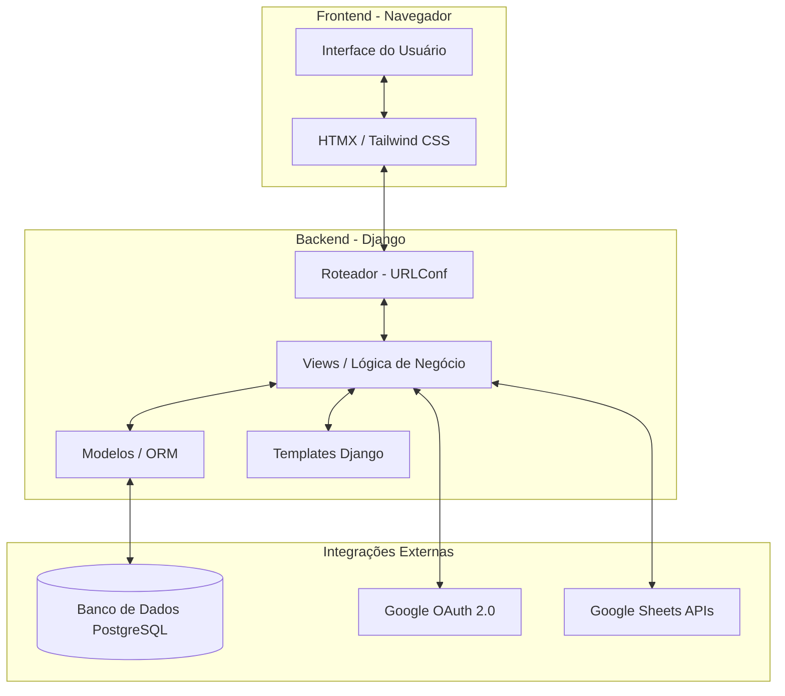

# 🏗️ Arquitetura do Sistema

O **Mapa-Força** utiliza uma arquitetura baseada no padrão **MVT (Model-View-Template)** do Django, reforçada por **HTMX** no frontend para proporcionar uma experiência dinâmica de SPA (Single Page Application) sem a complexidade de um framework JavaScript pesado.

## 🧱 Diagrama de Arquitetura

## 🛡️ Separação de Responsabilidades
- **Frontend (Tailwind + HTMX)**: Camada de apresentação reativa. O HTMX gerencia requisições assíncronas e substitui fragmentos do DOM com o HTML retornado pelo servidor, evitando recarregamentos completos de página.
- **Backend (Django)**: 
    - **Models**: Definição da estrutura de dados e regras de integridade (ex: `CheckConstraints`).
    - **Views**: Processamento das regras de negócio operacionais, controle de acesso e orquestração de alocações.
    - **Services/Commands**: Scripts de sincronização com o Google Sheets que utilizam o Pandas para processar grandes volumes de dados de efetivo.
- **Integração Externa**: 
    - **Google OAuth**: Gerenciado via `django-allauth` para autenticação única institucional.
    - **Google Sheets**: Fonte externa de dados para sincronização periódica de efetivo e viaturas via CSV/XLSX.

## 🚀 Fluxo de Interação HTMX
O sistema utiliza o padrão de retornar **Partials** (fragmentos de HTML):
1. O usuário seleciona um militar para alocar em uma viatura.
2. O HTMX envia uma requisição `POST` para uma view específica do Django.
3. A view valida a alocação e retorna apenas o fragmento HTML (ex: o card da viatura atualizado).
4. O navegador atualiza apenas aquela parte da tela, mantendo o estado global.
