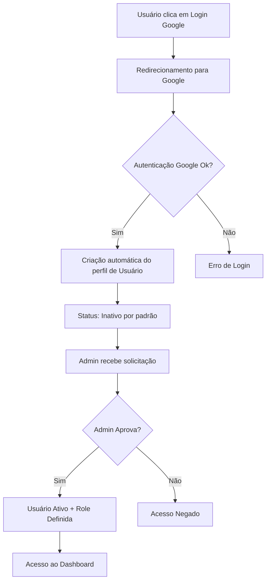
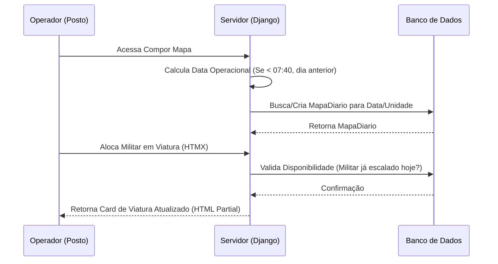
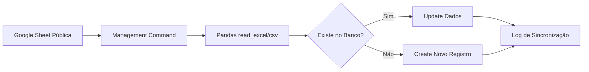

# 🔄 Fluxos do Sistema

O sistema possui fluxos críticos que garantem a segurança e a integridade dos dados operacionais.

## 🔐 Fluxo de Autenticação (Google OAuth)

A autenticação é feita exclusivamente via contas institucionais do Google. O sistema implementa uma camada extra de segurança para impedir acessos não autorizados.

## ⚙️ Ciclo de Vida Operacional (Mapa de Força)

A operação das unidades segue um ciclo diário rígido baseado no **Horário Operacional (07:40 AM)**.

## 📊 Sincronização de Dados (Google Sheets)

Para manter a base de dados sincronizada com as planilhas da corporação, o sistema executa comandos de gerenciamento.

- **Frequência**: Recomendado executar via Cron Job ou Celery Beat (diariamente às 02:00 AM).
- **Processamento**: O sistema utiliza o **Pandas** para processar as planilhas em massa, garantindo performance.

### Regras Críticas de Sincronização:
1. **Unicidade**: O RE (Registro Estatístico) é a chave primária lógica para funcionários.
2. **Histórico**: Funcionários que saem da planilha não são deletados, mas marcados como inativos para preservar o histórico das escalas passadas.
