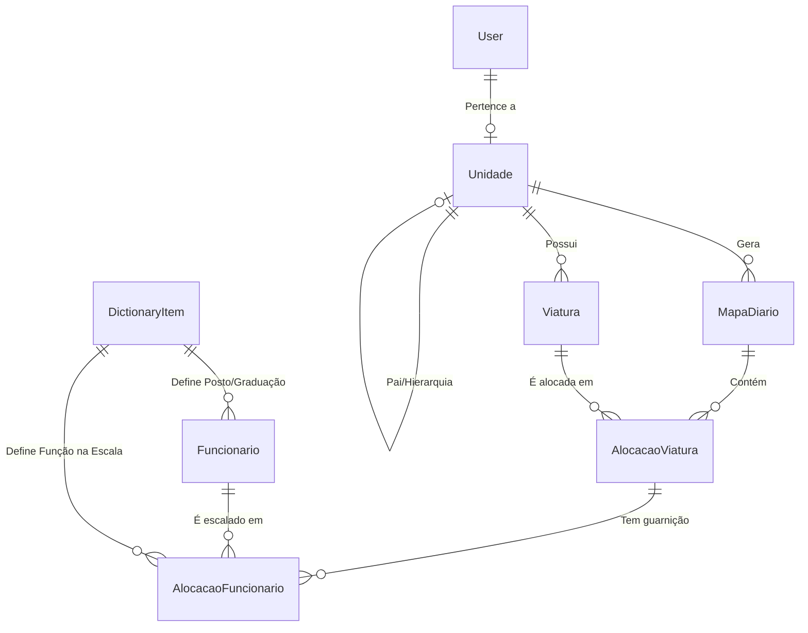

# 🗂️ Modelos de Dados

O banco de dados é estruturado para suportar a hierarquia organizacional e a complexidade das alocações operacionais.

## 📊 Diagrama Entidade-Relacionamento (ER)

## 🏗️ Principais Modelos

### 🏢 Unidades (App: `unidades`)
Define a estrutura da OPM (Organização Policial Militar).
- **`Unidade`**: Representa um Posto, SGB ou Batalhão. Possui auto-relacionamento (`parent`) para formar a árvore hierárquica.
- **`Viatura`**: Equipamentos vinculados a uma unidade específica. Contém informações técnicas (placa, prefixo, volume de água, combustível).

### 👮 Efetivo (App: `efetivo`)
Gerencia o capital humano.
- **`Funcionario`**: Contém o RE (ID único), nome de guerra, especialidades (Mergulho, OVB, etc.) e o vínculo com a unidade de destino.

### 📅 Escalas (App: `escalas`)
O núcleo operacional que une unidades, viaturas e pessoas em uma data.
- **`MapaDiario`**: Agregador principal. Garante a integridade da data operacional.
- **`AlocacaoViatura`**: Instância de uma viatura específica em um mapa diário. Pode ter campos extras como "KMs de saída".
- **`AlocacaoFuncionario`**: O "link" final. Define qual militar está em qual viatura e qual função (Motorista, Comandante, Auxiliar) está exercendo naquela data.

### 📗 Dicionários (App: `dictionaries`)
Tabelas de apoio para manter a consistência de nomenclaturas.
- **`DictionaryItem`**: Armazena postos/graduações (Soldado, Cabo, Sargento) e funções operacionais de forma dinâmica.

## 🛡️ Restrições de Integridade (Constraints)
O sistema implementa validações no nível do banco (Django ORM):
- **Unicidade de Escala**: Não pode haver dois mapas diários para a mesma unidade na mesma data.
- **Unicidade de Alocação**: Um militar não pode ser alocado em duas viaturas simultaneamente na mesma data operacional.
- **Hierarquia**: Apenas administradores podem gerenciar a árvore de unidades.
